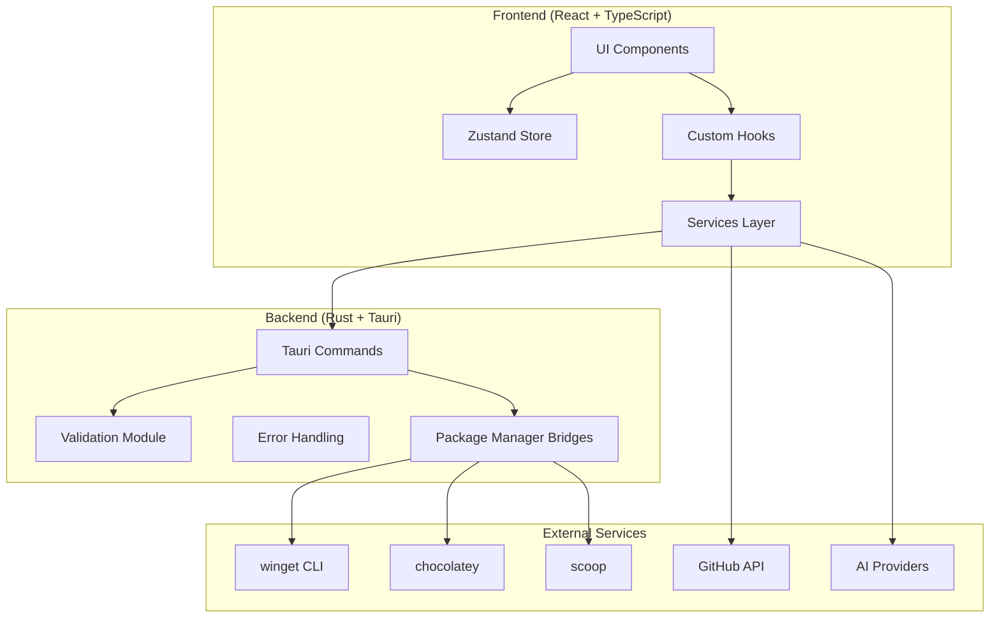
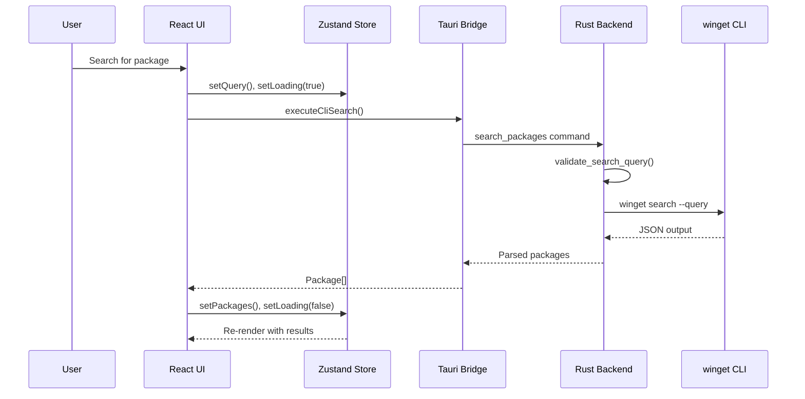

# Architecture Overview

## System Architecture



## Data Flow



## Directory Structure

```
winget/
├── src/                          # React frontend
│   ├── components/               # UI components
│   │   ├── layout/               # Layout components
│   │   └── settings/             # Settings tab components
│   ├── hooks/                    # Custom React hooks
│   │   ├── usePackageOperations  # Package install/upgrade/uninstall
│   │   ├── useSearchLogic        # Search handling
│   │   └── useKeyboardShortcuts  # Keyboard navigation
│   ├── services/                 # API & business logic
│   │   ├── tauriBridge.ts        # Tauri command wrappers
│   │   ├── wingetService.ts      # Package operations
│   │   ├── githubService.ts      # GitHub API
│   │   └── aiService.ts          # AI providers
│   ├── stores/                   # Zustand state management
│   │   ├── store.ts              # Main store
│   │   └── slices/               # State slices
│   └── utils/                    # Utilities
│       └── logger.ts             # Structured logging
├── src-tauri/                    # Rust backend
│   └── src/
│       ├── main.rs               # Tauri entry point
│       ├── winget_commands.rs    # Package manager operations
│       ├── git_commands.rs       # Git operations
│       ├── validation.rs         # Input validation
│       ├── errors.rs             # Error types
│       └── progress.rs           # Progress tracking
└── .github/workflows/            # CI/CD
    ├── ci.yml                    # Continuous integration
    └── release.yml               # Automated releases
```

## Key Design Patterns

### 1. Command Pattern (Tauri)

All backend operations are exposed as Tauri commands:

```rust
#[tauri::command]
pub async fn search_packages(query: String, manager: String) -> Result<String, String>
```

### 2. Slice Pattern (Zustand)

State is organized into logical slices:

- `settingsSlice` - User preferences
- `cartSlice` - Selected packages
- `chatSlice` - AI chat history
- `uiSlice` - UI state

### 3. Bridge Pattern (tauriBridge.ts)

Frontend services communicate through a unified bridge:

```typescript
export const executeCliSearch = async (query: string, manager: string) => {
  return await invoke<string>('search_packages', { query, manager });
};
```

### 4. Error Boundary Pattern

React error boundaries catch and handle runtime errors gracefully.

## Security Model

1. **Input Validation**: All user inputs validated in Rust before execution
2. **Command Allowlist**: Only specific CLI tools can be executed
3. **Credential Storage**: API keys stored in OS keyring
4. **CSP**: Content Security Policy in Tauri config
